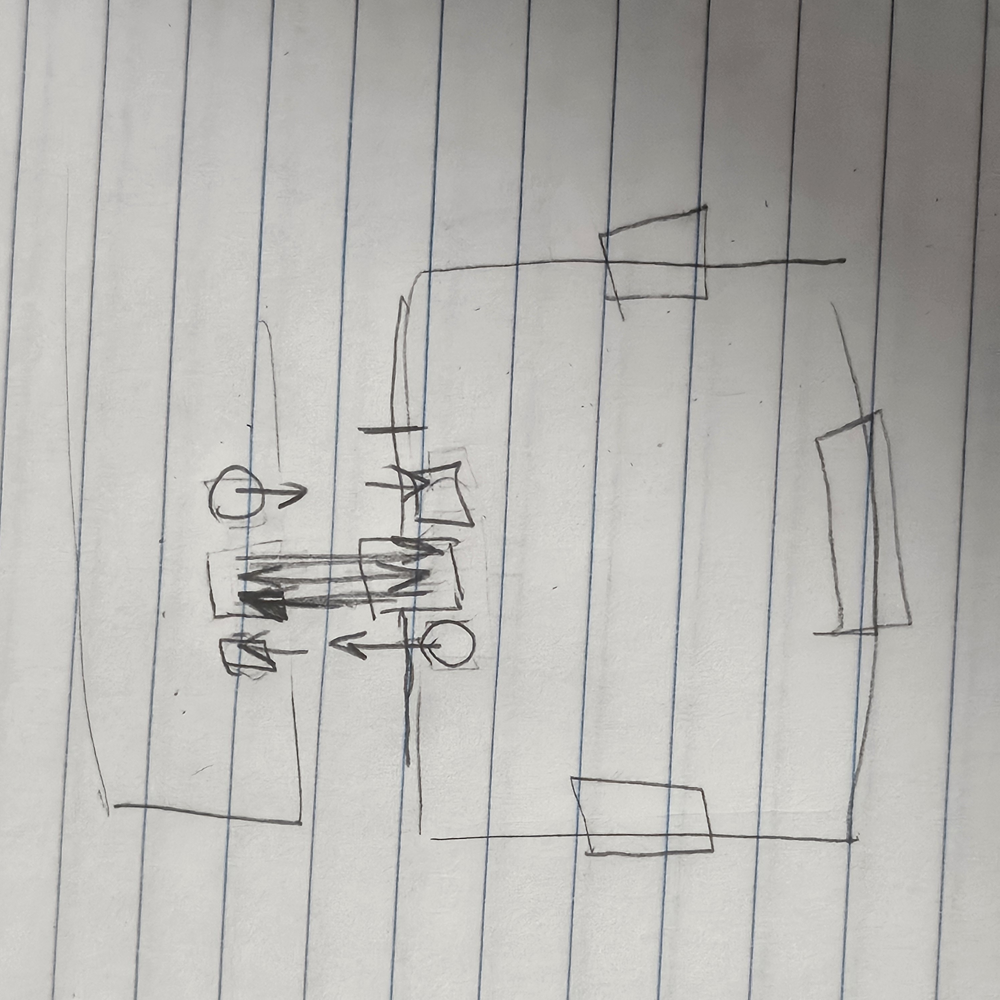

### per tile:
#### microcontroller
- ESP32 for OTA flashing (ESP32 OTA firmware server, version check, update multiple devices)
- [ESP32 DevKit](https://docs.espressif.com/projects/esp-dev-kits/en/latest/esp32s3/esp32-s3-devkitc-1/user_guide_v1.1.html) reference to develop ESP board
#### sensor matrix (do this next!)
- sensor matrix scanning
- scan sensor matrix
- row column sensor matrix
- microcontroller reading matrix sensor
- sensor preprocessing
#### ws2812 led matrix
decide dimensions and led count
only needs 1 pin and shared power rails

### tile-to-tile communication
communication should include an instruction to animate certain leds
[ESP-32 NOW](https://dronebotworkshop.com/esp-now/)

### neighbor and orientation detection

- hall effect sensor to detect presence of another tile/magnet
- MAC_IN_X pin to read neighbor's mac address
- MAC_OUT_X pin to transmit mac address
- shared GND
to connect using ESP NOW

total gpio pins used form neighbor orientation detection:
- 4 edges X 3 pins = 12 GPIO pins

### power (decide this last!)
- shared power rail electronics

after the details are straightened out, we can build a prototype with 4 tiles! how exciting!